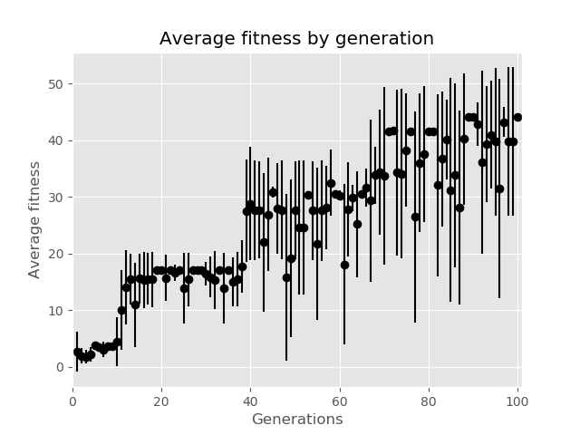

# NaturalSelection

An all-purpose pythonic genetic algorithm, which also has built-in hyperparameter tuning support for neural networks.


## Installation

```
$ pip install naturalselection
```


## Usage

Here is a toy example optimising a pair of numbers with respect to division.

```python
>>> import naturalselection as ns
>>> Pair = ns.Genus(x = range(1, 10000), y = range(1, 10000))
>>> def division(number):
...   return number.x / number.y
...
>>> pairs = ns.Population(genus = Pair, size = 10, fitness_fn = division)
>>> history = pairs.evolve(generations = 100, progress_bars = 1)
Evolving population: 100%|███████████████████| 100/100 [00:19<00:00,  5.03it/s]
>>> history.fittest
{'genome': {'x': 9527, 'y': 190}, 'fitness': 50.142105263157895}
>>> history.plot()
```




Here is an example of finding a feed-forward neural network to model [MNIST](https://en.wikipedia.org/wiki/MNIST_database).

```python
>>> import naturalselection as ns
>>> from tensorflow.keras.utils import to_categorical
>>> import mnist
>>> X_train = ((mnist.train_images() / 255) - 0.5).reshape((-1, 784))
>>> Y_train = to_categorical(mnist.train_labels())
>>> X_val = ((mnist.test_images() / 255) - 0.5).reshape((-1, 784))
>>> Y_val = to_categorical(mnist.test_labels())
>>> fitness_fn = ns.get_nn_fitness_fn(
...   kind = 'fnn',
...   train_val_sets = (X_train, Y_train, X_val, Y_val),
...   loss_fn = 'binary_crossentropy',
...   score = 'accuracy',
...   output_activation = 'softmax',
...   max_training_time = 60
...   )
>>> fnns = ns.Population(
...   genus = ns.FNN(),
...   fitness_fn = fitness_fn,
...   size = 50
...   )
>>> history = fnns.evolve(generations = 10)
Evolving population: 100%|██████████████████| 10/10 [1:07:19<00:00, 403.97s/it]
Computing fitness for generation: 100%|████████| 50/50 [06:57<00:00, 20.05s/it]
>>> history.fittest
{'genome': {'optimizer': 'adam', 'hidden_activation': 'relu', 'batch_size': 64, 'initializer': 'he_normal', 'input_dropout': 0.0, 'hidden_dropout': (0.3, 0.0, 0.5), 'layers': (128, 1024)}, 'fitness': 0.965}
>>> history.plot(
...   title = "Average accuracy by generation",
...   ylabel = "Average accuracy"
...   )
```


## License

This project is licensed under the [MIT License](LICENSE).
